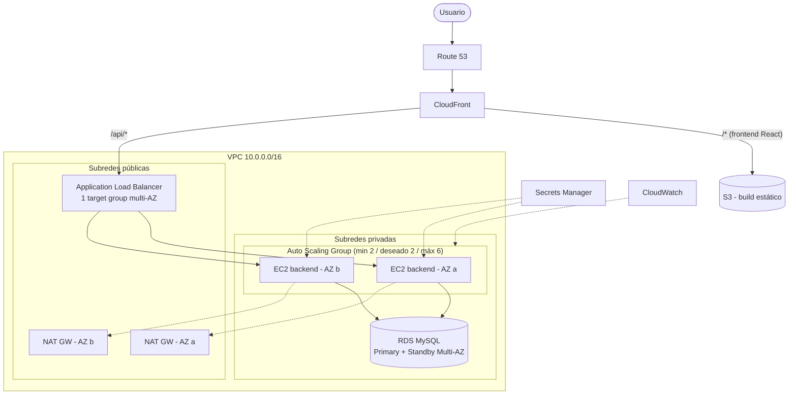

# CaribeXperience — Aplicación Web de Alta Disponibilidad en AWS

> Plataforma de reserva de experiencias turísticas (estilo "Airbnb Experiences") enfocada en la Costa Caribe colombiana, diseñada para desplegarse en AWS con alta disponibilidad.

**Universidad Tecnológica de Bolívar — Infraestructura de TI / Infraestructura como Código & DevOps**
**Proyecto 01:** Aplicación Web de Alta Disponibilidad con Balanceo de Carga en AWS
**Grupo:** Los Parrilleros

---

## Tabla de contenido

1. [Descripción](#1-descripción)
2. [Arquitectura](#2-arquitectura)
3. [Stack tecnológico](#3-stack-tecnológico)
4. [Estructura del repositorio](#4-estructura-del-repositorio)
5. [Estado del proyecto](#5-estado-del-proyecto)
6. [Ejecutar la aplicación en local](#6-ejecutar-la-aplicación-en-local)
7. [Infraestructura con Terraform](#7-infraestructura-con-terraform)
8. [Configuración con Ansible](#8-configuración-con-ansible)
9. [Pipeline CI/CD](#9-pipeline-cicd)
10. [Seguridad](#10-seguridad)
11. [Costos y buenas prácticas](#11-costos-y-buenas-prácticas)
12. [Documentación adicional](#12-documentación-adicional)
13. [Equipo](#13-equipo)

---

## 1. Descripción

CaribeXperience es una aplicación web full stack con dos roles:

- **Guía:** publica, edita y elimina sus experiencias turísticas (tours, actividades) y consulta las reservas que recibe.
- **Viajero:** busca experiencias con filtros (ciudad, categoría, fecha), las reserva con control de cupo y consulta su historial de reservas.

La autenticación se hace con **JWT**, por lo que el backend es **stateless**: cualquier instancia puede atender cualquier petición. Esto es lo que permite repartir tráfico entre varias instancias EC2 detrás de un balanceador de carga.

El objetivo académico es aprovisionar la infraestructura **completamente como código** (Terraform), configurar los servidores con **Ansible** y automatizar el flujo con **GitHub Actions**.

## 2. Arquitectura

Diagrama editable: [`docs/diagramas/arquitectura-aws-ha.drawio`](docs/diagramas/arquitectura-aws-ha.drawio) (abrir en [app.diagrams.net](https://app.diagrams.net)).



### Principios de diseño

| Componente | Punto único de falla que elimina |
|---|---|
| 2 Availability Zones | Caída de un centro de datos completo |
| ALB único con target group multi-AZ | Caída del balanceador (el ALB es redundante entre AZs) |
| Auto Scaling Group (mínimo 2) | Caída de una instancia individual |
| RDS MySQL Multi-AZ | Caída de la base de datos, mantenimiento o falla de disco |
| NAT Gateway por AZ | Pérdida de salida a Internet si cae una AZ |
| S3 + CloudFront | Servidor de archivos estáticos caído / latencia |
| Backend stateless (JWT) | Dependencia de sesiones en memoria de una instancia |

> **Nota de diseño:** una primera versión del diagrama dibujaba un ALB por AZ. Se corrigió a **un solo ALB** con un target group que registra las instancias de ambas AZs, que es lo que permite un balanceo real entre zonas. El detalle de cada componente está en [`docs/14-etapa13-arquitectura-aws.md`](docs/14-etapa13-arquitectura-aws.md).

## 3. Stack tecnológico

| Capa | Tecnología |
|---|---|
| Backend | Java 17 + Spring Boot 3.3 |
| Persistencia | Spring Data JPA + Hibernate |
| Migraciones | Flyway (`V1`–`V6`) |
| Base de datos | MySQL 8 |
| Seguridad | Spring Security + JWT (jjwt) |
| Mapeo / utilidades | MapStruct + Lombok |
| Documentación de API | springdoc-openapi (Swagger UI) |
| Pruebas | JUnit 5, Mockito, Spring Security Test, Testcontainers |
| Frontend | React 19 + Vite + TypeScript |
| Frontend (libs) | React Router, React Hook Form + Zod, Axios, Tailwind CSS 4 |
| Contenedores | Docker + Docker Compose (nginx sirve el frontend) |
| IaC | Terraform (provider AWS `~> 5.0`) |
| Configuración | Ansible |
| CI/CD | GitHub Actions |
| Nube | AWS (VPC, EC2, ALB, Auto Scaling, RDS, S3, CloudFront, Route 53, Secrets Manager, CloudWatch) |

## 4. Estructura del repositorio

```
project-infra/
├── .github/workflows/
│   └── terraform-ci.yml        # Pipeline de validación de Terraform
├── ansible/
│   └── site.yml                # Playbook: instala Nginx en los webservers
├── backend/                    # API REST (Spring Boot)
│   ├── src/main/java/com/caribexperience/
│   │   ├── config/  domain/  repository/  service/
│   │   ├── security/  exception/  common/
│   │   └── web/ (controller, dto, mapper)
│   ├── src/main/resources/db/migration/   # Migraciones Flyway
│   ├── src/test/                          # Pruebas unitarias e integración
│   ├── Dockerfile                         # Build multi-etapa (Maven -> JRE 17)
│   └── docker-compose.yml                 # MySQL + backend + frontend
├── frontend/                   # SPA React + Vite
│   ├── src/ (api, auth, components, pages, routes, lib, types)
│   ├── Dockerfile              # Build multi-etapa (Node -> nginx)
│   └── nginx.conf              # SPA fallback + proxy /api -> backend
├── terraform/
│   └── main.tf                 # Provider AWS, VPC y subredes públicas
└── docs/                       # Plan, diseño de BD, etapas y arquitectura AWS
    └── diagramas/arquitectura-aws-ha.drawio
```

## 5. Estado del proyecto

| Área | Estado |
|---|---|
| Aplicación (backend + frontend) | Completa: auth, CRUD de experiencias, reservas con control de cupo, historial |
| Contenerización (Docker / Compose) | Completa y probada en local |
| Diseño de arquitectura AWS | Completo (diagrama + documentación) |
| Terraform | **En progreso:** provider, VPC `10.0.0.0/16` y 2 subredes públicas (1a y 1b) |
| Ansible | **En progreso:** playbook base que instala y habilita Nginx |
| CI/CD | **En progreso:** job de validación (`fmt`, `init`, `validate`) |

Pendiente para las siguientes entregas: subredes privadas, Internet/NAT Gateway, tablas de rutas, Security Groups, ALB, Launch Template y Auto Scaling Group, módulos reutilizables, remote state (S3 + DynamoDB), roles/inventario dinámico en Ansible y los jobs `plan`/`apply`/`configure` del pipeline.

## 6. Ejecutar la aplicación en local

### Requisitos

- Docker y Docker Compose
- (Opcional, para desarrollo sin contenedores) JDK 17, Maven 3.9+, Node 22+

### Con Docker Compose (recomendado)

```bash
git clone <URL-DEL-REPOSITORIO>
cd project-infra/backend
docker compose up --build
```

Esto levanta tres contenedores en una red interna:

| Servicio | URL |
|---|---|
| Frontend (nginx) | http://localhost:8082 |
| Backend (API) | http://localhost:8080 |
| Swagger UI | http://localhost:8080/swagger-ui.html |
| Health check | http://localhost:8080/actuator/health |
| MySQL | `localhost:3306` |

Las migraciones de Flyway crean el esquema y cargan los catálogos (ciudades, categorías, roles, estados) automáticamente al arrancar el backend.

Para apagar todo: `docker compose down` (agregar `-v` para borrar también los datos de MySQL).

### Variables de entorno del backend

| Variable | Descripción | Valor por defecto (solo desarrollo) |
|---|---|---|
| `DB_URL` | URL JDBC de MySQL | `jdbc:mysql://localhost:3306/caribexperience?...` |
| `DB_USERNAME` / `DB_PASSWORD` | Credenciales de la BD | `caribe_user` / `caribe_pass` |
| `JWT_SECRET` | Secreto de firma JWT (mínimo 256 bits) | valor de ejemplo, **cambiar en producción** |
| `JWT_EXPIRATION_MS` | Vigencia del token | `86400000` (24 h) |
| `CORS_ALLOWED_ORIGINS` | Orígenes permitidos | `http://localhost:5173` |
| `SERVER_PORT` | Puerto del backend | `8080` |

### Desarrollo sin contenedores

```bash
# Backend (requiere un MySQL accesible; ver variables arriba)
cd backend
mvn spring-boot:run

# Frontend
cd frontend
npm ci
npm run dev        # http://localhost:5173
```

### Pruebas

```bash
cd backend
mvn test           # Las pruebas de integración usan Testcontainers (requiere Docker)
```

### Endpoints principales

| Método | Ruta | Descripción |
|---|---|---|
| POST | `/api/usuarios/registro` | Registro de usuario (Guía o Viajero) |
| POST | `/api/auth/login` | Inicio de sesión, devuelve JWT |
| GET | `/api/catalogos/ciudades`, `/api/catalogos/categorias` | Catálogos para filtros |
| GET | `/api/experiencias` , `/api/experiencias/{id}` | Listado con filtros y detalle |
| GET | `/api/experiencias/mias` | Experiencias del Guía autenticado |
| PUT / DELETE | `/api/experiencias/{id}` | Editar / eliminar (solo el Guía dueño) |
| POST | `/api/reservas` | Crear reserva (valida cupo) |
| GET | `/api/reservas/mias` | Historial del Viajero |
| GET | `/api/reservas/recibidas` | Reservas recibidas por el Guía |
| DELETE | `/api/reservas/{id}` | Cancelar reserva |

La referencia completa y probable está en Swagger UI.

## 7. Infraestructura con Terraform

Directorio: [`terraform/`](terraform/)

Recursos definidos actualmente:

- Provider AWS (`~> 5.0`) en `us-east-1`, con `default_tags` (`Project`, `Environment`, `Student`).
- VPC `10.0.0.0/16` con DNS habilitado.
- Subred pública `10.0.1.0/24` en `us-east-1a` y `10.0.2.0/24` en `us-east-1b`.

### Uso

```bash
cd terraform
terraform init
terraform fmt -check
terraform validate
terraform plan
terraform apply
```

> Las credenciales de AWS **nunca** se escriben en el código: se usan variables de entorno (`AWS_ACCESS_KEY_ID`, `AWS_SECRET_ACCESS_KEY`) o un perfil local de AWS CLI.

> **Importante:** al terminar cada sesión de trabajo ejecutar `terraform destroy` para controlar costos.

### Alcance previsto

Subredes privadas, Internet Gateway y NAT Gateway, ALB con target group HTTP (puerto 80) y health checks, Auto Scaling Group (mín. 2, deseado 2, máx. 6, `t3.micro`) con política de escalado por CPU > 70 % durante 2 minutos, Security Groups (ALB: 80/443 desde Internet; EC2: 80 solo desde el ALB), módulos de red y cómputo, y remote state en S3 con bloqueo en DynamoDB.

## 8. Configuración con Ansible

Directorio: [`ansible/`](ansible/)

El playbook `site.yml` configura los hosts del grupo `webservers`, de forma idempotente:

1. Actualiza el índice de paquetes (`apt`).
2. Instala Nginx.
3. Asegura que el servicio esté iniciado y habilitado.
4. Despliega una página de inicio base.

### Uso

```bash
cd ansible
ansible-playbook -i <inventario> site.yml
```

Donde `<inventario>` define el grupo `webservers` (por ahora un inventario estático; se migrará a inventario dinámico por etiquetas EC2).

### Alcance previsto

Roles `common`, `webserver` y `deploy`, variables por entorno en `group_vars` (dev/prod), configuración del firewall local e inventario dinámico (`aws_ec2`).

## 9. Pipeline CI/CD

Archivo: [`.github/workflows/terraform-ci.yml`](.github/workflows/terraform-ci.yml)

Se ejecuta en cada `push` y `pull request` hacia `main`:

1. Checkout del código.
2. Instalación de Terraform 1.5.0.
3. `terraform fmt`
4. `terraform init -backend=false`
5. `terraform validate`

### Alcance previsto

| Job | Descripción |
|---|---|
| `validate` | `fmt -check`, `validate` y `tflint` |
| `plan` | `terraform plan` con el resultado comentado en el PR |
| `apply` | `terraform apply` en merge a `main`, con aprobación manual |
| `configure` | Ejecuta el playbook de Ansible tras el despliegue |

Las credenciales de AWS se leerán desde **GitHub Secrets** (`AWS_ACCESS_KEY_ID`, `AWS_SECRET_ACCESS_KEY`).

## 10. Seguridad

- Backend y base de datos en **subredes privadas**, accesibles solo a través del ALB.
- **Security Groups** con mínimo privilegio: el ALB acepta 80/443 desde Internet; las instancias EC2 aceptan tráfico solo desde el Security Group del ALB.
- **Spring Security + JWT:** contraseñas con hash, rutas protegidas por rol y propiedad (un Guía solo modifica sus propias experiencias).
- **Secrets Manager** para `JWT_SECRET` y credenciales de RDS en AWS; las instancias los leen mediante un rol IAM de mínimo privilegio.
- El contenedor del backend corre con un **usuario no-root**.
- Los valores por defecto de `docker-compose.yml` (contraseñas de MySQL, `JWT_SECRET`) son **solo para desarrollo local** y deben reemplazarse en cualquier otro entorno.

## 11. Costos y buenas prácticas

- Todo recurso en la nube se define en código (sin clics en la consola).
- Etiquetas obligatorias en todos los recursos: `Project`, `Student`, `Environment`.
- Credenciales siempre por variables de entorno o GitHub Secrets; nunca en el repositorio.
- Para demos usar `t3.micro` y RDS Single-AZ, y ejecutar `terraform destroy` al terminar.

## 12. Documentación adicional

| Documento | Contenido |
|---|---|
| [`docs/00-plan-general.md`](docs/00-plan-general.md) | Plan, alcance y decisiones del proyecto |
| [`docs/01-diseno-base-datos.md`](docs/01-diseno-base-datos.md) | Modelo de datos |
| [`docs/02` a `docs/13`](docs/) | Documentación por etapa (backend, seguridad, pruebas, Docker, frontend) |
| [`docs/14-etapa13-arquitectura-aws.md`](docs/14-etapa13-arquitectura-aws.md) | Arquitectura AWS de alta disponibilidad |
| [`docs/Propuesta_Inicial_CaribeXperience.docx`](docs/Propuesta_Inicial_CaribeXperience.docx) | Propuesta inicial de infraestructura (primera entrega) |

## 13. Equipo

**Grupo Los Parrilleros** — Universidad Tecnológica de Bolívar
Docente: Rafael Enrique Monterroza Barrios

| Integrante |
| --- |
| Luis Ruz |
| Kathy Otero |
| Andres Buelvas |
| Yuliana Martelo |
| Emmanuel Buelvas |
