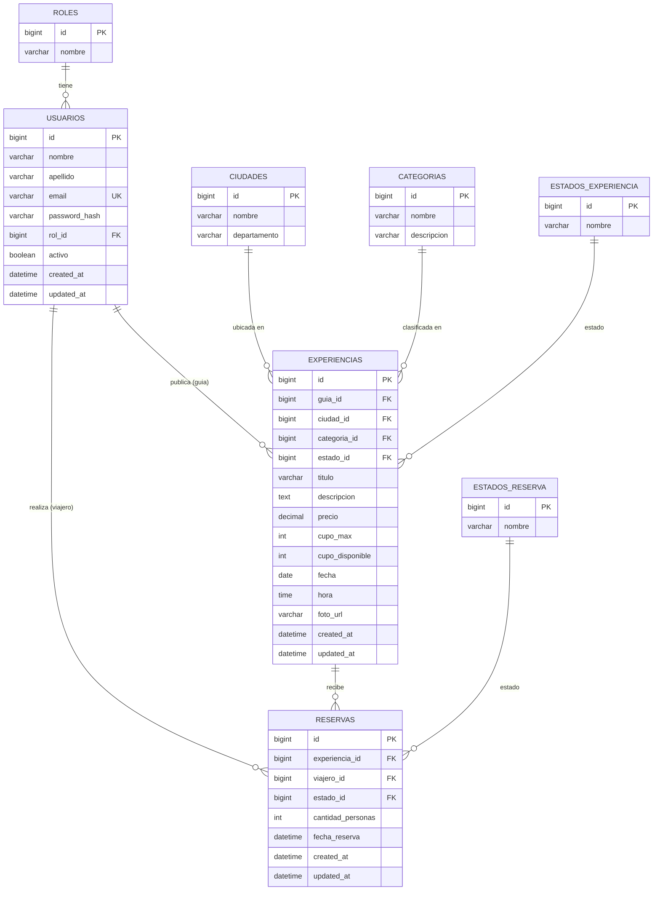

# Etapa 0 — Diseño de Base de Datos

## 1. Enfoque de diseño

Se optó por un modelo **normalizado (3FN)** usando **tablas catálogo** para roles y estados en lugar de `ENUM` de MySQL o "magic strings" en el código. Ventajas:

- Se pueden agregar nuevos roles/estados/categorías sin migrar el esquema (solo un `INSERT`).
- Integridad referencial garantizada por FK en vez de validación manual de strings.
- Es una práctica estándar en sistemas empresariales reales (mejor que `ENUM` embebido).

Todas las tablas transaccionales incluyen auditoría básica: `created_at`, `updated_at`. Se usa **borrado lógico** (`activo` / `estado`) en vez de `DELETE` físico, para no perder historial de reservas.

## 2. Modelo Entidad-Relación

## 3. Catálogo de tablas

### `roles`
| Columna | Tipo | Restricción |
|---|---|---|
| id | BIGINT | PK, AUTO_INCREMENT |
| nombre | VARCHAR(20) | UNIQUE, NOT NULL |

Valores semilla: `GUIA`, `VIAJERO`, `ADMIN` (admin reservado para uso futuro).

### `usuarios`
| Columna | Tipo | Restricción |
|---|---|---|
| id | BIGINT | PK, AUTO_INCREMENT |
| nombre | VARCHAR(100) | NOT NULL |
| apellido | VARCHAR(100) | NOT NULL |
| email | VARCHAR(150) | UNIQUE, NOT NULL |
| password_hash | VARCHAR(255) | NOT NULL (BCrypt) |
| rol_id | BIGINT | FK → roles.id, NOT NULL |
| activo | BOOLEAN | DEFAULT TRUE |
| created_at | DATETIME | DEFAULT CURRENT_TIMESTAMP |
| updated_at | DATETIME | ON UPDATE CURRENT_TIMESTAMP |

### `ciudades`
Catálogo de ciudades de la Costa Caribe (Cartagena, Santa Marta, Barranquilla, Riohacha, Montería, Sincelejo, Valledupar).
| Columna | Tipo | Restricción |
|---|---|---|
| id | BIGINT | PK |
| nombre | VARCHAR(100) | NOT NULL |
| departamento | VARCHAR(100) | NOT NULL |

### `categorias`
Catálogo de tipos de experiencia (Aventura, Cultural, Gastronómica, Ecoturismo, Náutica, Nocturna).
| Columna | Tipo | Restricción |
|---|---|---|
| id | BIGINT | PK |
| nombre | VARCHAR(100) | NOT NULL |
| descripcion | VARCHAR(255) | NULL |

### `estados_experiencia`
Valores semilla: `ACTIVA`, `PAUSADA`, `FINALIZADA`, `CANCELADA`.

### `experiencias`
| Columna | Tipo | Restricción |
|---|---|---|
| id | BIGINT | PK |
| guia_id | BIGINT | FK → usuarios.id, NOT NULL |
| ciudad_id | BIGINT | FK → ciudades.id, NOT NULL |
| categoria_id | BIGINT | FK → categorias.id, NOT NULL |
| estado_id | BIGINT | FK → estados_experiencia.id, NOT NULL |
| titulo | VARCHAR(150) | NOT NULL |
| descripcion | TEXT | NOT NULL |
| precio | DECIMAL(10,2) | NOT NULL, CHECK >= 0 |
| cupo_max | INT | NOT NULL, CHECK > 0 |
| cupo_disponible | INT | NOT NULL, CHECK >= 0 |
| fecha | DATE | NOT NULL |
| hora | TIME | NOT NULL |
| foto_url | VARCHAR(500) | NULL (URL a S3) |
| created_at / updated_at | DATETIME | auditoría |

**Regla de negocio:** `cupo_disponible` inicia igual a `cupo_max` y se decrementa con cada reserva confirmada.

### `estados_reserva`
Valores semilla: `PENDIENTE`, `CONFIRMADA`, `CANCELADA`.

### `reservas`
| Columna | Tipo | Restricción |
|---|---|---|
| id | BIGINT | PK |
| experiencia_id | BIGINT | FK → experiencias.id, NOT NULL |
| viajero_id | BIGINT | FK → usuarios.id, NOT NULL |
| estado_id | BIGINT | FK → estados_reserva.id, NOT NULL |
| cantidad_personas | INT | NOT NULL, CHECK > 0 |
| fecha_reserva | DATETIME | NOT NULL, DEFAULT CURRENT_TIMESTAMP |
| created_at / updated_at | DATETIME | auditoría |

**Regla de negocio:** al crear una reserva con estado `CONFIRMADA`, se valida `cantidad_personas <= experiencia.cupo_disponible` y se descuenta. Al `CANCELAR`, se devuelve el cupo (esto se implementa en la capa de servicio, dentro de una transacción, en la Etapa 3).

## 4. Relaciones (resumen)

- `roles (1) — (N) usuarios`
- `usuarios (1) — (N) experiencias` (como guía)
- `usuarios (1) — (N) reservas` (como viajero)
- `ciudades (1) — (N) experiencias`
- `categorias (1) — (N) experiencias`
- `estados_experiencia (1) — (N) experiencias`
- `experiencias (1) — (N) reservas`
- `estados_reserva (1) — (N) reservas`

Ningún borrado físico en cascada: se usará `ON DELETE RESTRICT` en las FKs para proteger integridad histórica (no se puede borrar un usuario/experiencia con reservas asociadas; se inactiva en su lugar).

## 5. Estrategia de migraciones (Flyway)

Ubicación: `backend/src/main/resources/db/migration/`

| Archivo | Contenido |
|---|---|
| `V1__create_catalog_tables.sql` | roles, ciudades, categorias, estados_experiencia, estados_reserva |
| `V2__seed_catalog_data.sql` | INSERTs semilla de los catálogos anteriores |
| `V3__create_usuarios_table.sql` | tabla usuarios + FK a roles |
| `V4__create_experiencias_table.sql` | tabla experiencias + FKs |
| `V5__create_reservas_table.sql` | tabla reservas + FKs |
| `V6__create_indexes.sql` | índices adicionales (búsquedas por ciudad/fecha/estado) |

Cada migración es **versionada e inmutable** una vez aplicada (regla de Flyway): si hay que corregir algo después de aplicarla, se crea una nueva `V7__...`, nunca se edita una ya ejecutada.

## 6. Índices recomendados

- `experiencias(ciudad_id, fecha)` — para filtros de búsqueda
- `experiencias(guia_id)` — para listar "mis experiencias"
- `reservas(viajero_id)` — para "mis reservas"
- `reservas(experiencia_id)` — para "reservas recibidas"
- `usuarios(email)` — ya es UNIQUE, sirve como índice de login

---
**Siguiente paso:** aprobar este diseño para iniciar la **Etapa 1 — Setup del proyecto Spring Boot + migraciones Flyway** (`02-etapa1-setup-flyway.md`).
